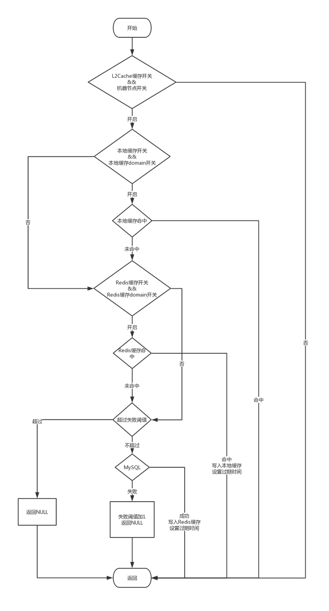

# mcache

#### 介绍

mcache是一个整合caffeine+redis的二级缓存工具，对于读请求频繁访问的场景，有巨大的性能提升（相同架构的工具，已经过生产实践，表现优秀，性能提升巨大，rpc接口压测，95rt都在5ms以内）。

#### 特性

1. 一级缓存采用Caffeine Cache，二级缓存采用redis。
2. 采用Spring AOP + Annotation 将缓存管理与业务逻辑进行解耦。
3. 采用懒加载机制 + 防止缓存穿透。
4. 加入redis异常重试降级，以及自动恢复功能。
5. 本地缓存结果copy，避免直接修改本地缓存引发问题。

#### 缓存一致性问题

1. 是以持久化数据库中的数据为标准，redis只作为缓存使用（不开启备份，出现服务宕机级别问题，所有数据都从数据库重新读取缓存，保证数据一致性）。
2. 先更新数据库，然后删除缓存，本地缓存通过使用消息中间件广播通知删除。
3. 如果删除redis缓存失败，会进行redis异常重试，超过重试次数就会触发降级，直连数据库。（已有的生产实践中只出现过机房出现事故，zk、redis等服务全部停摆，这个时候重试并没有什么用）
4. 如果删除本地缓存失败，则需要等待缓存失效。（本地缓存ttl默认设置5分钟，生产实践中，影响不大，在可以接受的范围）

#### 缓存加载流程

1. 首先通过配置中心获取L2Cache缓存开关、开启的机器节点配置、本地缓存开关、本地缓存按domain开关、redis开关及redis缓存按domain开关，同时对配置中心进行监听，当有配置修改，及时获取修改的配置信息。(
   配置中心非必须配置，无配置则为打开)
2. 如果L2Cache缓存开关打开，并且运行服务的服务器属于开启L2Cache缓存的机器节点，则进入下一步。 如果本地缓存开关和本地缓存domain开关同时开启则到一级缓存中获取。
3. 如果本地缓存开关和本地缓存domain开关没有同时开启，则一级缓存不命中。 如果本地缓存命中，返回。 如果本地缓存不命中，进入下一步。 如果redis缓存开关和redis缓存domain开关同时开启则到二级缓存redis中获取。
4. 如果redis缓存开关和redis缓存domain开关没有同时开启则二级缓存不命中。 如果redis缓存命中，则将结果写入一级缓存并返回。 如果redis缓存不命中，且超过当前Key失败阈值，返回NULL。(防止缓存穿透)
5. 如果redis缓存不命中，且不超过当前Key失败阈值。 回源到MySQL获取，获取成功，删除阈值Key，写入二级缓存(设置TTL加上随机值)，返回。 回源到MySQL获取，获取失败，Key失败计数加1，返回NULL。
   

#### 缓存清除

1. 自动清除 设置本地缓存写后过期时间。 考虑业务场景 ，暂定过期时间为5分钟。(可通过配置对不同domain的缓存写后过期时间进行个性化配置)
2. 程序清除(业务数据变更的清除)，通过监听MQ进行缓存数据清除。


#### 使用说明
整个二级缓存项目，采用Spring AOP + Annotation将缓存管理与业务逻辑进行解耦，
通过切面读取配置中心的配置，来进行个性化参数设定、运行开关及节点灰度，完成设定和获取开关后，
以环绕的方式干预业务逻辑。该项目主要需要内部依赖于spring-framework，外部依赖于caffeine，guava。

#### 范例
```java
/**
 * 缓存使用范例
 *
 * @author moon
 */
public class Test {

   @Cache(domain = "mcache", keys = {"#id", "#param.code"}, clazz = Result.class)
   public Result testCache(Long id, Param param) {
      return new Result();
   }

   @CacheEvict(domain = "mcache", keys = {"#id", "#param.code"}, evictAfterTranCommit = true)
   public void testCacheEvict(Long id, Param param) {
   }
}
```

#### TODO
1. 缓存Tamplate操作方式
2. 本地缓存批量获取
3. redis缓存批量获取
